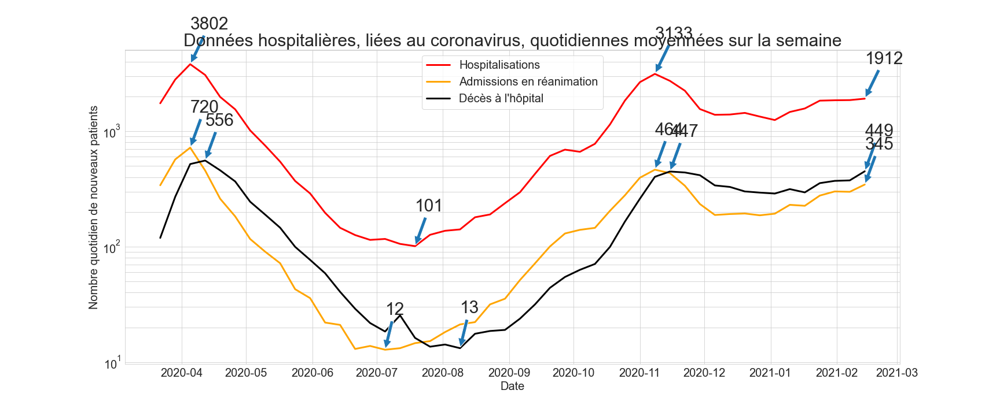
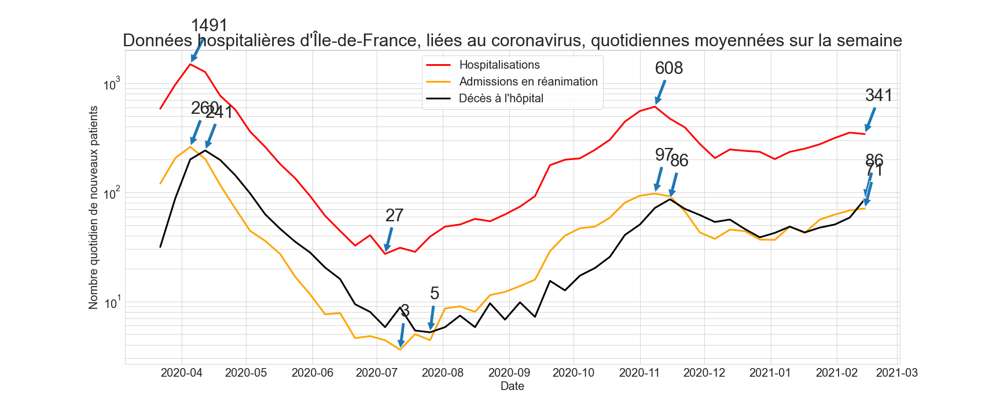

# Coronavirus dans les hôpitaux français
Ce dépôt permet de voir en temps réel la situation des hôpitaux français par rapport au coronavirus. Le fichier principal est covid.ipynb.

Les données sont issues de [data.gouv.fr : Données hospitalières relatives à l'épidémie de COVID-19](data.gouv.fr/fr/datasets/donnees-hospitalieres-relatives-a-lepidemie-de-covid-19).

## Graphiques
Tous les graphiques ont une échelle logarithmique en ordonnée. Cela semble plus adapté pour décrire l'évolution d'une épidémie.

### Moyenne par semaine

### Valeur quotidienne

### En Île-de-France

# Résultats des tests virologiques
Dans le fichier tests.ipynb, on peut aussi visualiser les données relatives aux tests. Elles sont issues de [data.gouv.fr : Données relatives aux résultats des tests virologiques COVID-19](data.gouv.fr/fr/datasets/donnees-relatives-aux-resultats-des-tests-virologiques-covid-19).
